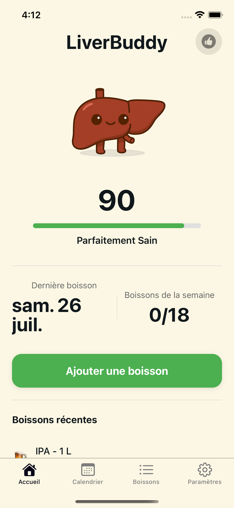
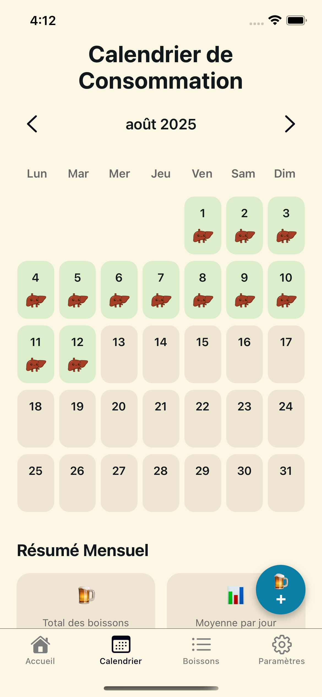

# LiverBuddy

LiverBuddy helps you track your drinks in real time, estimate your blood alcohol concentration (BAC), and stay within safe limits. It offers quick logging, custom drink presets, reminders, and helpful insights to encourage healthier habits.




[Testflight](https://testflight.apple.com/join/QBg5ckvN)

## Features

- Quick-add drinks with amount and ABV presets
- BAC estimation over time with metabolism and body metrics
- Simple daily goals and streaks
- Insights: units per day/week, drink history
- Local-first storage with optional backups (planned)

## Tech

- Expo (React Native, Expo Router)
- TypeScript
- Zustand for state management

## Getting started

1. Install dependencies

   ```bash
   npm install
   ```

2. Start the app (choose simulator or device in the prompt)

   ```bash
   npx expo start
   ```

3. Open on:

   - iOS Simulator (press i)
   - Android Emulator (press a)
   - Expo Go on a device (scan QR)

Project source lives in the `app` directory and uses file-based routing.

## Development scripts

```bash
npm run lint     # Lint code
npm run typecheck# TypeScript checks
```

## Screenshots

The screenshots above are stored at:

- `assets/images/simulator-screen-1.png`
- `assets/images/simulator-screen-2.png`

## License

MIT
